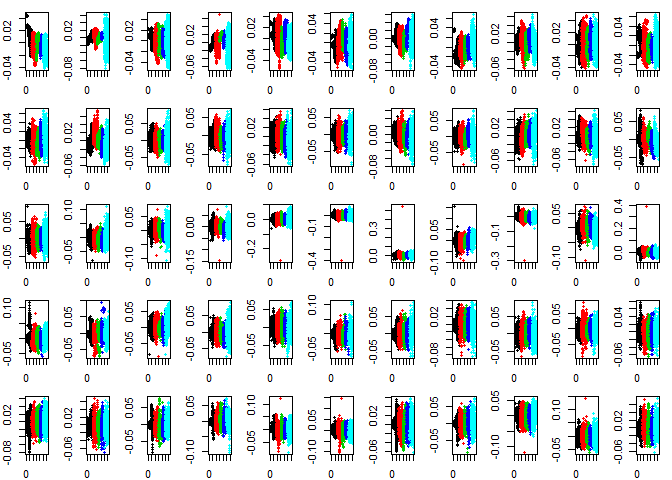
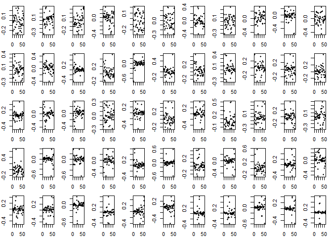
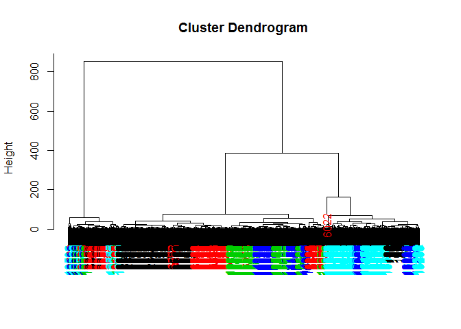

Practical Machine learning Final Project Report
===============

To view report in html follow this [link](http://htmlpreview.github.io/?https://github.com/sumitkant/Coursera-Practical-Machine-Learning/blob/master/Project/Report.html)

Loading dataset
----------------

``` r
pml <- read.csv("pml-training.csv")
dim(pml)
```

    ## [1] 19622   160

We have dataset with 19622 observations of 160 variables.

Cleaning dataset
----------------

### Missing Values

``` r
colmeans <- sapply(pml, function(x){mean(is.na(x))})
missing <- colmeans > 0
pml.1 <- pml[,!missing]
dim(pml.1)
```

    ## [1] 19622    93

After this operation we are left with 93 variables

### Near Zero Variance

Looking out for varibles with near zero variance which would not contribute much in prediciting the class.

``` r
library(caret)
nzv <- nearZeroVar(pml.1, saveMetrics = T)
pml.2 <- pml.1[,!nzv$nzv]
pml.2 <- pml.2[,-1]
dim(pml.2)
```

    ## [1] 19622    58

After this operation we found 58 predictors to work with.

Exploratory Data Analysis
-------------------------

### Considering only one subject - 'carlitos'

``` r
# Subsetting for subject 1
carlitos <- subset(pml.2, pml.2$user_name == "carlitos")
dim(carlitos)
```

    ## [1] 3112   58

We have got 3112 observations of 58 variables

### Singular Value decomposition

``` r
# Singular Value Decomposition
numeric <- sapply(carlitos, is.numeric)
carlitos.numeric <- carlitos[,numeric]
svd1 = svd(scale(carlitos.numeric))
```

### PLotting Left Singular Vector

``` r
# PLotting Left Singular vector
ncol(svd1$u)
```

    ## [1] 55

``` r
par(mfrow=c(5,11), mar = c(2,2,1,1))
for (x in 1:55){
  plot(svd1$u[,x], pch = 20, col = carlitos$classe)
}
```



Plotting the left singular vector we observe that preditors have strong predictive capabilities and there is no single variable that classifies the way in which exercise was performed. So, the next step is find the maximum contributor

### Finding max contributor

``` r
# Finding max conributor
ncol(svd1$v)
```

    ## [1] 55

``` r
par(mfrow=c(5,11), mar = c(2,2,1,1))
for (x in 1:55){
  plot(svd1$v[,x], pch = 20, col = carlitos$classe)
}
```



Here, in the right singular vector, the second column has most variance.

``` r
maxContrib <- which.max(svd1$v[,2])
names(carlitos)[maxContrib]
```

    ## [1] "magnet_belt_x"

Is the max contributor

### Clustering with Maxcontributors

``` r
distanceMatrix <- dist(carlitos[,c(5:7,maxContrib)])
hclustering <- hclust(distanceMatrix)
source("mypclust.R")
par(mfrow =c(1,1))
myplclust(hclustering, lab.col = unclass(carlitos$classe))
```



These four variables are not able to identify the clusters properly. So trying with K-means clustering.

### K means Clustering

``` r
# K means clustering
kclust <- kmeans(carlitos.numeric, centers = 5, nstart = 150)
table(kclust$cluster, carlitos$classe)
```

    ##    
    ##       A   B   C   D   E
    ##   1 190 134 105  81 129
    ##   2 159 141 116 113  99
    ##   3 166 133  74  86 117
    ##   4 184 158 107 115 148
    ##   5 135 124  91  91 116

THe clusters formed in k means clustering even after using 150 different starts are too mixed up. There are no variables that show clear demarcation in the classes. So linear regression would not work.

Predictive Model
----------------

-   Fitting the model with Gradient Boosting Method Algorithm with 10 fold Cross Validation, since calling gbm with cross validation imporves performance

``` r
library(caret)
set.seed(123)
system.time(boostFit <- train(classe ~ ., method = "gbm", 
                  data = pml.2, 
                  verbose = F, 
                  trControl = trainControl(method = "cv", number = 10)))
```

``` r
boostFit
```

    ## Stochastic Gradient Boosting 
    ## 
    ## 19622 samples
    ##    57 predictor
    ##     5 classes: 'A', 'B', 'C', 'D', 'E' 
    ## 
    ## No pre-processing
    ## Resampling: Cross-Validated (10 fold) 
    ## Summary of sample sizes: 17661, 17659, 17660, 17660, 17660, 17659, ... 
    ## Resampling results across tuning parameters:
    ## 
    ##   interaction.depth  n.trees  Accuracy   Kappa    
    ##   1                   50      0.8390083  0.7957339
    ##   1                  100      0.8972077  0.8698327
    ##   1                  150      0.9269705  0.9074870
    ##   2                   50      0.9583127  0.9472228
    ##   2                  100      0.9867501  0.9832396
    ##   2                  150      0.9922030  0.9901378
    ##   3                   50      0.9854246  0.9815645
    ##   3                  100      0.9934770  0.9917497
    ##   3                  150      0.9964835  0.9955522
    ## 
    ## Tuning parameter 'shrinkage' was held constant at a value of 0.1
    ## 
    ## Tuning parameter 'n.minobsinnode' was held constant at a value of 10
    ## Accuracy was used to select the optimal model using  the largest value.
    ## The final values used for the model were n.trees = 150,
    ##  interaction.depth = 3, shrinkage = 0.1 and n.minobsinnode = 10.

The accuracy of model was 0.996

Predictions
-----------

The final model chosen is the Gradient Boosted model. The final Predictions are predicted as follows.

``` r
testing <- read.csv("pml-testing.csv", header  = T)
predictions <- predict(boostFit, newdata = testing)
predictions
```

    ##  [1] B A B A A E D B A A B C B A E E A B B B
    ## Levels: A B C D E
